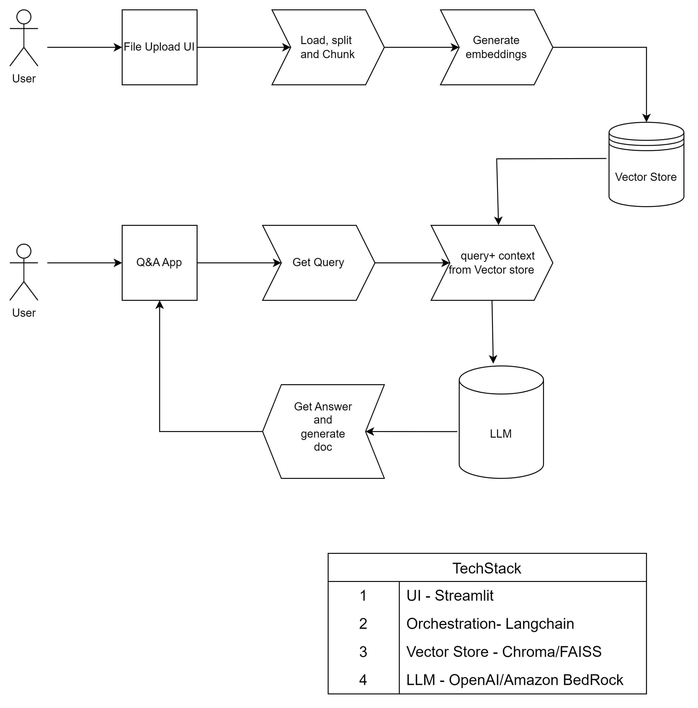

# Gen AI Q&A App

This project is a Gen AI Q&A app enabling users to upload documents(of extension ['.pdf','.docx','txt','.csv','.xlsx','.yaml']) and use it as context to query an LLM for answers. The app also gives option to generate the chat history and generate pdfs in preview mode for use cases and download them

# Architecture

# Description
This app follows RAG(Retrieval Augumented Generation) approach to query the LLM in conjunction with a vector store to create embeddings and store the embeddings of the input documents. This app have two flavours  
    1. Streamlit + OpenAI + ChromaDB
    2. Streamlit + Amazon BedRock + FAISS

# How to run
1. Intsall the required python modules by running 'pip install -r requirements.txt'

2. To use Open API as the LLM need to have a OPEN_AP_KEY which can be given in .env file or can be given as an input in Streamlit UI

3. To use Amazon BedRock you need to have a 'default' or a 'custom' aws profile configured with access to Amazon Bedrock which need to be given

4. To run the app run  'streamlit run {pythonfile}'(eg.streamlit run chat_with_openai_rag.py)